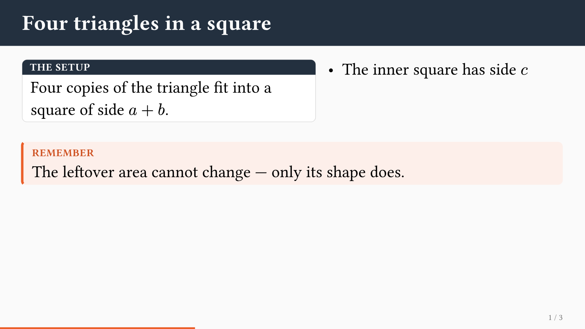
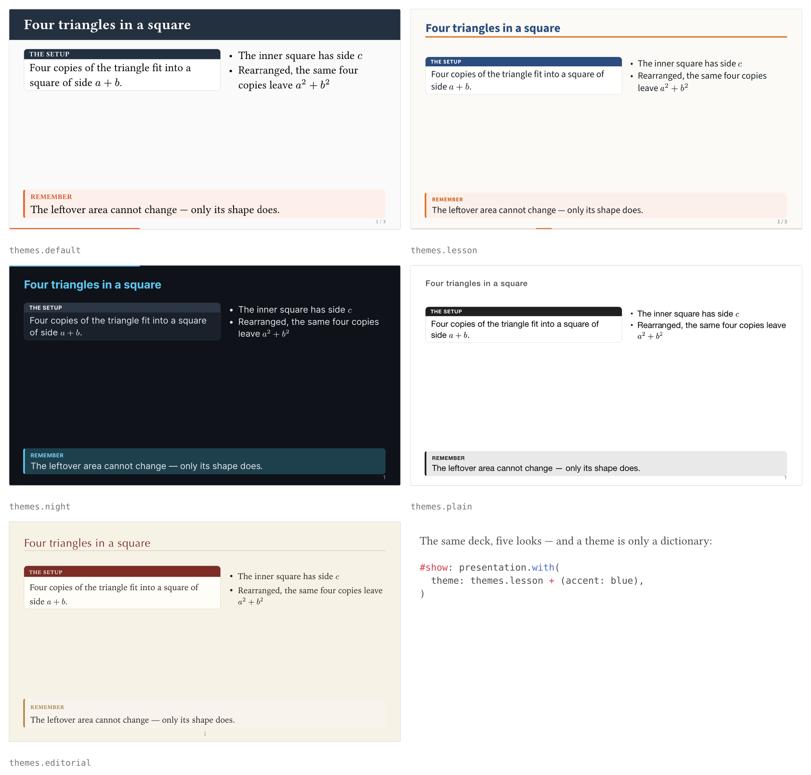
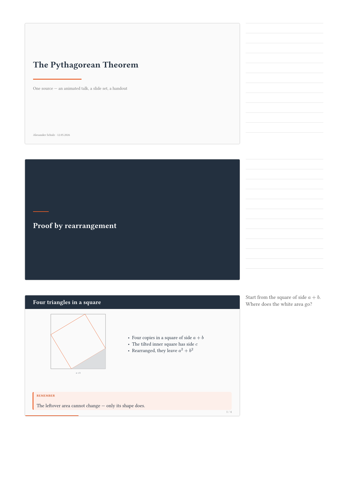

# typstage

**Animated HTML presentations from a single Typst file, and the slide set and
the handout as PDF from that same file.**

```bash
typst compile deck.typ deck.html --format html --features html   # the animated talk
typst compile deck.typ deck.pdf                                  # slides and handout
```



**Try it without installing anything:** [six example decks](https://loewe1000.github.io/typstage/beispiele/), running in your browser. They are written as talks somebody might actually give rather than as feature demos: a tour of the package itself, how GPS finds you, why the four margins of a book are unequal, a school lesson on completing the square, a night of rolling deployments, and Simpson's paradox.

## Typst sets, the browser moves

The usual route from Typst to a presentation is a PDF in which every step
occupies a page of its own; nothing ever moves. Typst's own HTML export goes
the other way and leaves the arrangement to the browser, which loses exactly
what Typst is used for.

typstage takes a third route. Every slide is typeset by Typst and written into
the HTML **as SVG**, so what stands in the browser stands there the way Typst
set it, to the point, and it is the same layout the PDF shows. Only then does anything
move: whatever should stir is announced in the source, and a small runtime
moves it with the Web Animations API.

One source, three outputs:

| | |
| --- | --- |
| **Animated talk** | a single self-contained `.html`: reveals, magic move, slide transitions, video, embedded documents. Double-click it; no server, no network, nothing to install alongside |
| **Slide set** | one PDF page per slide rather than one per step, with every tracked element in its final state |
| **Handout** | `handout: 3` puts the same slides on A4, speaker notes or ruled lines beside them |

## A complete deck

This file compiles, as it stands, with both commands above.

```typ
#import "@schule/typstage:0.1.0": *

#show: presentation.with(
  title: [The Pythagorean Theorem],
  author: [A. Schulz],
  transition: "slide",
)

= Proof by rearrangement

== Four triangles in a square

#side-by-side(
  card(title: [The setup])[
    Four copies of the triangle fit into a square of side $a + b$.
  ],
  stagger[
    - The inner square has side $c$
    - Rearranged, the same four copies leave $a^2 + b^2$
  ],
)

#v(1fr)

#callout(title: [Remember])[
  The leftover area cannot change. Only its shape does.
]

== The claim

#align(center, morph(<pythagoras>, $a^2 + b^2$))

== #h(0pt)

#place(center + horizon,
       morph(<pythagoras>, text(size: 2.6em)[$a^2 + b^2 = c^2$]))
```

`=` opens a section slide, `==` a slide, `== #h(0pt)` a slide without a title
band. `stagger` reveals a list point by point, and the same
`morph(<pythagoras>)` on two slides makes the formula fly from the one place to
the other, growing on the way. Nothing carries a step number: `at` is `auto` by
default and means *the next free step*, so consecutive reveals number
themselves. Names are labels or strings: `morph(<pythagoras>, …)` and
`morph("pythagoras", …)` are the same thing.

For a slide that simply unfolds, nothing needs wrapping at all:

```typ
== A slide that unfolds

First this.

#pause

Then that.
```

Slides may also be handed over as arguments, `presentation(title-slide(…),
section([…]), slide([Title])[…])`, for decks that are generated rather than
written.

## The building blocks

| | |
| --- | --- |
| `presentation` | builds the deck: slides as arguments, or a show-rule body split at its headings |
| `bundle` | writes talk, slide set and handout in a single compile |
| `slide`, `section`, `title-slide` | the three kinds of slide |
| `anim`, `stagger`, `pause`, `alternatives` | reveal one thing, a series of things, everything after this point, one thing after another in the same place |
| `morph`, `pin` | magic move across slides; `pin` names a glyph so the pairing follows the name rather than the shape |
| `card`, `callout`, `side-by-side`, `tiles`, `statement` | layouts inside a slide; `tiles` staggers itself, and `side-by-side(equal: true)` makes its columns the same height |
| `transition`, `speaker-note` | how this slide comes in, and what only you see |
| `themes`, `theme` | the five built-in looks, and the builder behind them |
| `video`, `embed`, `flipbook` | media, arbitrary web content in a sandboxed frame, and animation drawn frame by frame by Typst |
| `bridge-job`, `bridge-targets` | send step jobs into an embedded document, which is how companion packages drive an applet |
| `slide-width`, `slide-height`, `slide-margin`, `dark`, `accent`, `paper`, `muted` | the defaults behind `width:` and the palette |
| `runtime-version`, `runtime-files` | the CSS and the JS, for `assets: "split"` and for CDNs |

Every one of them is documented in full, with examples, in the manual
(`docs/content.typ`, see below).

Twelve slide transitions (`fade`, `slide`, `push`, `cover`, `uncover`, `zoom`,
`blur`, `iris`, `wipe`, `flip`, `cube`, `none`), set for the deck or for a
single slide, each of them a true reversal when you page backwards. Entrances
(`enter:`) work the same way: paging back takes the entrance away again.

## Themes

```typ
#show: presentation.with(theme: themes.night)
#show: presentation.with(theme: themes.lesson + (accent: blue))
```



A theme is a dictionary: colours, fonts, sizes, and one word each for the few
built shapes (`header`, `footer`, `progress`, `box`). That is why `+` is enough
to bend one, and `theme(…)` builds a new one from scratch. `header: "run"`
gives a slide the running head of a textbook page, slide number on the left and
the current section on the right; `box: "label"` builds cards the way a
textbook does, a tinted panel with its label inside rather than a coloured bar
above. Only the title slide
and the section slide are functions in it: they are whole pictures, not
variations of one another.

## In the browser

The runtime counts in **steps**, not slides: a slide with three reveals has
three steps, and `→` goes to the next one wherever it is.

| key | |
| --- | --- |
| `→` `←`, space, page keys | one step on, one step back |
| `Home`, `End` | first and last step, without motion |
| `o`, `Esc` | overview of all slides |
| `f` | full screen |
| `s` | the speaker note for this slide |
| `p` | print view: one slide per page, everything visible |
| `n` | open the speaker view in a second window |
| `?` | the key map |

Clicking the left quarter of the window goes back, anywhere else forward. On a
phone or tablet the same works with a finger, and so does swiping: right to
left brings the next slide, the other way the previous one. The address bar
carries the current step (`#12`), so a reloaded window stands where it stood.

## The speaker view

`n` opens the same file a second time, with `#speaker` on the address, in a
second window. Put that one on your laptop and the first one on the projector.
The two talk to each other with `postMessage`, which works between two local
files as well, so this needs no server either.

The speaker view shows the running slide large, the next **step** beside it
(not the next slide: a deck that counts in steps has to answer what the next
keypress does), the note below, and a clock, an elapsed timer and a pace
against a target duration you can type in.

You can draw on the running slide there, and the strokes appear on the
projected one. Strokes stick to their slide, so paging away and back brings
them with you; `x` clears the current slide, `z` takes back the last stroke,
`c` changes colour. `b` blacks the room out, `e` freezes the projected image
while you page ahead in private, and both end by themselves if the speaker
window goes away.

`m` switches the pointer between pen and embed. In pointer mode the pen rests
and a click on an embedded frame reaches the projected one instead: the same
spot, the same gesture, in whatever size that window happens to have. Where the
embedded document can mirror itself, as a GeoGebra applet does through
`typstage-geogebra`, you operate the live one in front of you and the projected
copy follows.

Steering works from either window, and either one may be reloaded: they find
each other again and the strokes come back.

## On paper

The PDF has one page per slide in the size of the canvas. Everything that moves
in the browser stands there in its final state. What belongs to the motion
alone, the notes, the transitions, the jobs for embedded elements, produces no
output and falls away by itself. Where a frame or an applet stands in the browser, `embed` takes
a `fallback` (any content at all, a CeTZ drawing, an image) and a `link` that is
clickable in the PDF.

One argument turns the slide set into a handout:

```typ
#show: presentation.with(handout: 3)   // three slides per A4 page
```



`handout` takes `true` (two per page) or a number from 1 to 6, and only affects
the PDF; the HTML ignores it. The slides are not re-set, only shrunk, so the
handout cannot drift away from what stood on the screen. Beside or below each
slide stands its `speaker-note`; where a slide has none, ruled lines take its
place.

### All three in one run

Typst 0.15 can write several files from one compile, which suits a package
where talk, slide set and handout come from the same source and differ only in
their target:

```typ
#bundle(
  theme: themes.lesson,
  title: [Completing the Square],
  handout: "handout.pdf",
)[
  = A section
  == A slide
  Text.
]
```

```bash
typst compile --features bundle,html --format bundle talk.typ out
```

The counters start again for each output, so the slide set numbers its slides
from one rather than carrying on where the HTML left off. Two things to know:
bundle export is experimental in Typst and needs the feature flag, and a file
that calls `bundle` can only be compiled with `--format bundle`. To keep both
routes open, put the body in a `#let` and call `presentation` yourself.

## The canvas

16:9 on an A4-width canvas by default, so a slide and a handout page carry text
at the same physical size. Any other shape is one to three arguments:

```typ
#show: presentation.with(width: 800pt, height: 600pt)   // 4:3
#show: presentation.with(margin: 48pt)                  // more air
```

Everything the theme draws, the title band, the type sizes, the rules, is
measured on the default canvas and scaled with the width, so a narrower deck
looks the same, only smaller. Only the *ratio* really changes the layout, and
the browser follows it, stage, overview thumbnails and printed pages alike.

## CSS and JavaScript

```typ
#show: presentation.with(assets: "inline")                          // default
#show: presentation.with(assets: "split")
#show: presentation.with(assets: (cdn: "https://cdn.example.org/ts/"))
```

`"inline"` puts both files into the HTML, one file that can be mailed, put on
a stick and opened without a network. `"split"` links `typstage-0.1.0.css` and
`.js` next to the HTML, a CDN the same names under the given address; the names
carry the version so several releases can live side by side. Typst creates no
files: write the two out once from `runtime-files`, which the bundle export can
do in the same run.

## Installation

The package lives in the local `@schule` namespace and is **not on Typst
Universe**. Clone it under the package path:

```bash
git clone https://github.com/Loewe1000/typstage \
  ~/Library/Application\ Support/typst/packages/schule/typstage/0.1.0
```

On Linux that path is `~/.local/share/typst/packages/schule/…`, on Windows
`%APPDATA%\typst\packages\schule\…`.

Needs Typst 0.15. The HTML target additionally needs `--features html`; nothing
else, no Node, no bundler.

## What it cannot do

- **Typst's HTML export is experimental.** Every HTML run needs
  `--features html` and prints a warning, and the export may change under you
  from one Typst release to the next. That is Typst's building site, not this
  package's, but you stand on it. The PDF side uses no experimental features.
- **The slides are SVG outlines, not text.** Glyphs go into the file as paths,
  so nothing in the browser is selectable, searchable or reflowable, screen
  readers see nothing, and the file grows with the deck. Measured: the little
  deck above weighs 211 kB, the six example decks between 1.1 and 2.0 MB, and
  the largest of them holds 127 SVG trees with 5581 glyph references across 23
  slides. In exchange no font has to load and the layout cannot drift.
- **`#pause` is read at the top level of a slide body only.** Inside a grid
  cell, a table or a figure it is not seen, so reach for `anim` there.
- **Not on Universe**, so `@preview` will not find it and there is no version
  resolution: you install it by hand, as above.
- **German in places.** The manual is German throughout and the API comments
  are mixed German and English. The two strings the runtime shows for itself,
  the `?` help line and the note of a slide that has none, follow the
  document language and exist in German, English and French; anything else
  falls back to English.
- **Five themes, not a theme ecosystem.** They differ in colour, type and the
  shape of header, footer and progress bar, not in slide layouts. Anything
  further is a dictionary entry, a `style:` wrapper, or plain Typst.

## Documentation

The [manual](https://loewe1000.github.io/typstage/) covers steps, magic move,
transitions, media, the bridge and a full API reference. It is published from
this repository, together with the [example decks](https://loewe1000.github.io/typstage/beispiele/).
The German source is `docs/content.typ`, the English one `docs/content-en.typ`.

| | Website | PDF |
| --- | --- | --- |
| English | [en.html](https://loewe1000.github.io/typstage/en.html) | [typstage-en.pdf](https://loewe1000.github.io/typstage/typstage-en.pdf) |
| German | [index](https://loewe1000.github.io/typstage/) | [typstage.pdf](https://loewe1000.github.io/typstage/typstage.pdf) |

One run gives the printed manual, the website and its stylesheet:

```bash
typst compile docs/docs.typ build --format bundle --features bundle,html --root .
```

`example.typ` in the repository is a deck that exercises everything: reveals,
magic move, an embedded live canvas, a CeTZ flipbook. It is not shipped with
the package, so build it from a clone.

## Companion packages

`typstage-geogebra` adds GeoGebra applets. It is a package of its own so that a
deck without applets carries none of it; everything it needs from the core is
`embed(bridge: …)` and `bridge-job`.

## License

MIT.
